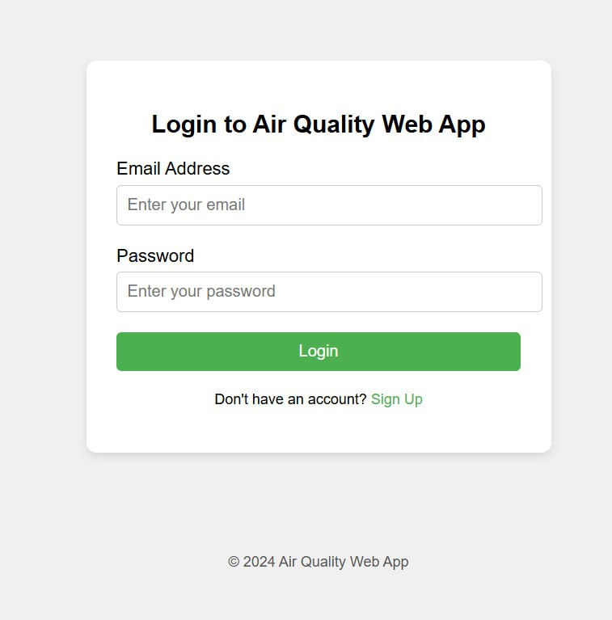
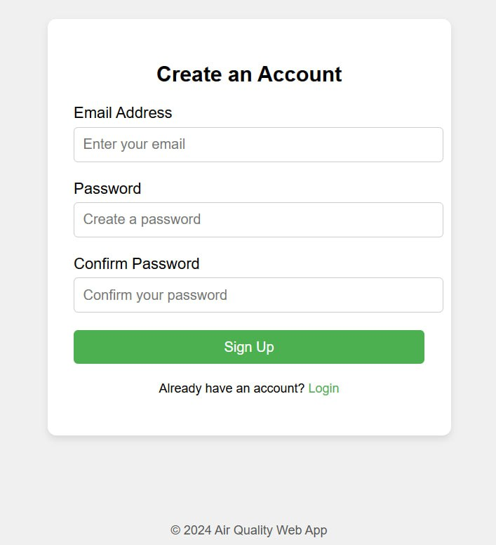
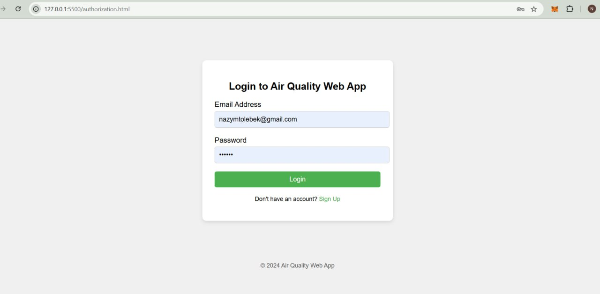
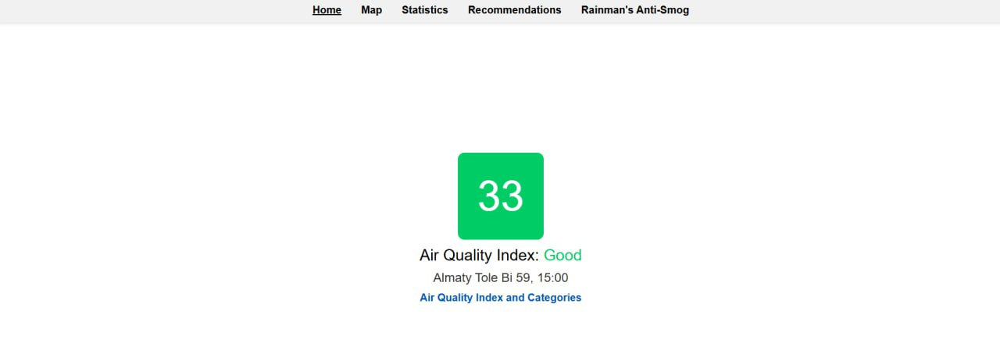
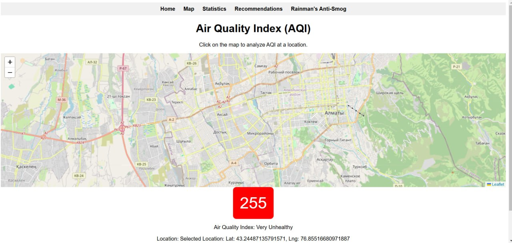
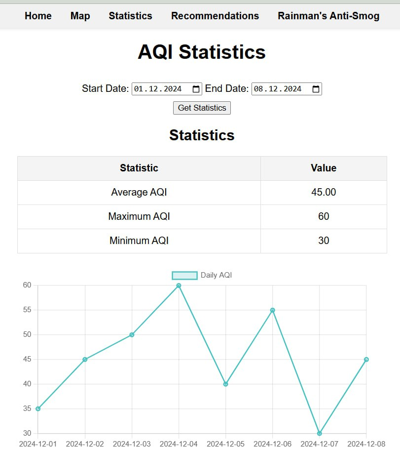
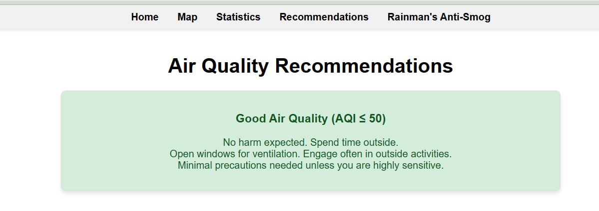
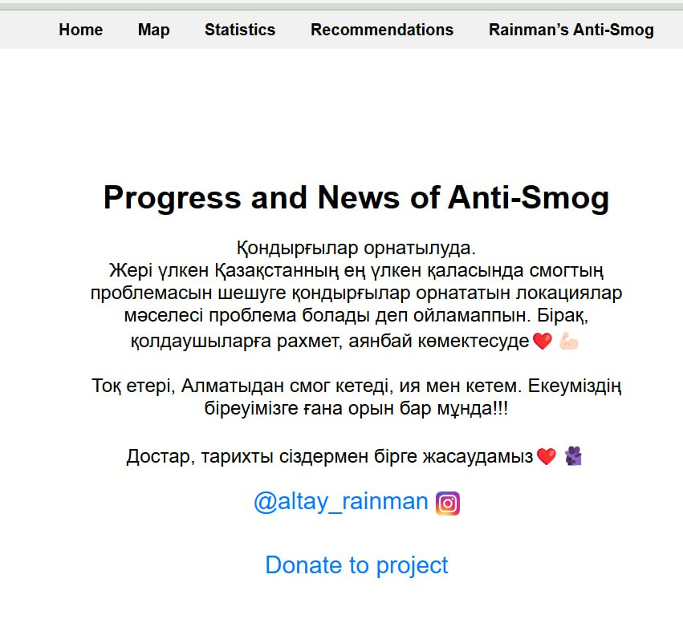
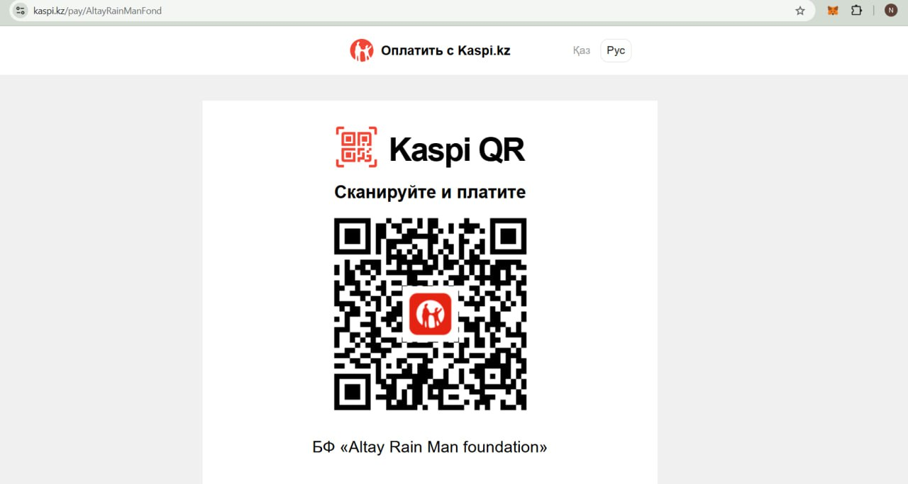

# Air Quality Application

## Overview
The Air Quality Application is designed to provide users with real-time information about air quality in their area, offer historical data, and suggest actionable recommendations based on the air quality index (AQI). The app aims to raise awareness and encourage community action to combat air pollution.

## Features
The application is built around several key features, each addressing specific user needs:

### Authorization
- **New User Registration**
  - Users can register by entering their email and setting a password.
  - Confirmation codes are sent via email to verify accounts.
- **User Login**
  - Registered users can log in using their email and password.
- **Forgot Password**
  - Users can reset their password by receiving a reset link via email.

### Home Tab
- **Air Quality Information**
  - Displays the current air quality index (AQI) and its category (e.g., Good, Moderate, Unhealthy).
  - Requires location permission to provide localized data.
- **AQI Categories**
  - Provides a breakdown of AQI ranges and their corresponding categories.

### Map Tab
- **Air Quality Visualization**
  - Displays AQI data on a map within a 1 km radius.
  - Uses color coding to indicate air quality categories.

### Statistics Tab
- **Historical AQI Data**
  - Users can view AQI trends by selecting a start and end date.

### Recommendations Tab
- **Personalized Recommendations**
  - Offers guidance based on the user's local air quality conditions, such as minimizing outdoor activity or using air purifiers.

### Rainman’s Anti-Smog Initiative
- **Project News and Updates**
  - Shares updates about ongoing anti-smog initiatives.
- **Social Media Links**
  - Provides links to the project’s official social media accounts.
- **Donations**
  - Redirects users to the "Altay Rain Man Foundation" payment section on Kaspi.kz to support the project.

## User Stories
### Authorization
- **As a new user**, I want to register using my email and password so that I can access the app.
- **As a registered user**, I want to log in using my credentials so that I can view air quality data.
- **As a registered user**, I want to reset my password in case I forget it so that I can regain access to my account.

### Air Quality Data
- **As a user**, I want to see the AQI and category for my location so that I can understand the air quality in my area.
- **As a user**, I want to view a breakdown of AQI ranges and categories so that I can interpret the data.

### Map
- **As a user**, I want to see AQI data visualized on a map so that I can understand the air quality around me.

### Statistics
- **As a user**, I want to view historical AQI data for a selected date range so that I can analyze trends over time.

### Recommendations
- **As a user**, I want to receive recommendations based on the air quality category so that I can take appropriate actions.

### Rainman’s Anti-Smog Initiative
- **As a user**, I want to view news and updates about the project so that I can stay informed.
- **As a user**, I want to access links to the project’s social media accounts so that I can follow them.
- **As a user**, I want to donate to the project so that I can support the initiative.

## Contributions
- Tolebek Nazym
- Amangeldinova Saya
- Igenbek Zhaina
- Tletay Azamat

## Screenshots

### Authorization

### Home Tab

### Map Tab

### Statistics Tab

### Recommendations Tab

### Rainman's Anti-Smog Project Tab

